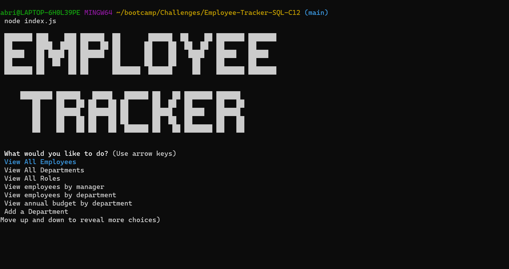
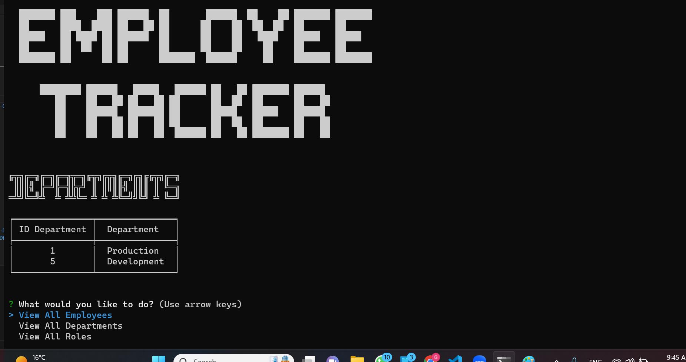

[License: GNU General Public License v3.0](https://www.gnu.org/licenses/gpl-3.0)

# Employee Tracker

## Description
This app is a JavaScript program that interacts with a MySQL database to manage employee data. It uses the Inquirer package to prompt the user with a list of actions they can take, such as viewing employees, departments, and roles, adding new employees, departments, and roles, updating employee information, and deleting data. The program also uses the table package to display the data in a formatted table. The program is designed to be run in a command-line interface.

## Table of Contents

- [Employee Tracker](#employee-tracker)
  - [Description](#description)
  - [Table of Contents](#table-of-contents)
  - [Installation](#installation)
  - [Screenshot path](#screenshot-path)
  - [Usage](#usage)
  - [Functionalities](#functionalities)
  - [Tools Used](#tools-used)
  - [License](#license)
  - [How to Contribute](#how-to-contribute)
  - [Questions](#questions)
  - [Credits](#credits)

## Installation 
Users can get started with this app by running the index.js file in their terminal and following the prompts to view, add, update, or delete employees, departments, and roles in a company database. The app uses inquirer and MySQL npm packages to interact with the user and the database. The initial prompt presents a list of options for the user to choose from, and each option corresponds to a function that performs a specific task. The app also includes validation for user input to ensure that required fields are not left blank. Before using this app, users will need to have a MySQL account set up with the appropriate permissions to access and modify the database. The app assumes that the user has a MySQL server running locally on their machine, but the connection details can be modified in the connection.js file if necessary. The user will need to provide their MySQL username and password in the connection.js file to establish a connection to the database.

## Screenshot path
Screenshots are available 

## Usage
Users can use this app to manage employee data, including viewing all employees, departments, and roles, adding new departments, roles, and employees, updating employee roles and managers, and deleting departments, roles, and employees. The app uses inquirer prompts to guide the user through each action and displays the data in a table format for easy viewing. The user can select the desired action from a list of options and follow the prompts to complete the action.

## Functionalities
The code above is a command-line application that allows users to manage employee data in a database. The functionalities include:

View all employees, departments, and roles
View employees by manager or department
View annual budget by department
Add a new department, role, or employee
Update an employee's role or manager
Delete a department, role, or employee

## Tools Used
Node JS.

## License

[License: GNU General Public License v3.0](https://www.gnu.org/licenses/gpl-3.0)

## How to Contribute  
Users can collaborate with this project at https://github.com/gabrielparada05/Employee-Tracker-SQL-C12

## Questions 
 Email: [gabrielparada05@gmail.com](mailto:gabrielparada05@gmail.com). Or, through my GitHub profile gabrielparada05, available at https://github.com/gabrielparada05.

## Credits
This project was developed by Gabriel Parada. The project was completed with the assistance of those amazing resources https://www.javascripttutorial.net/array/javascript-remove-duplicates-from-array/, https://www.geeksforgeeks.org/how-to-remove-duplicate-elements-from-javascript-array/. The ASCII were generated on http://patorjk.com/software/taag/#p=display&f=ANSI%20Shadow&t=.

